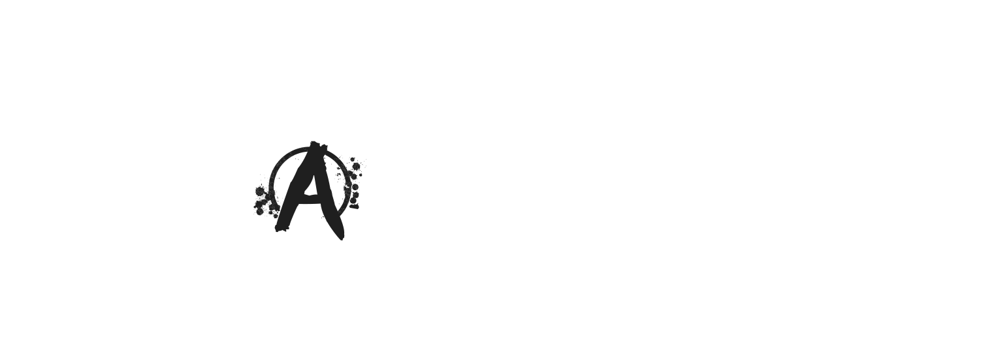
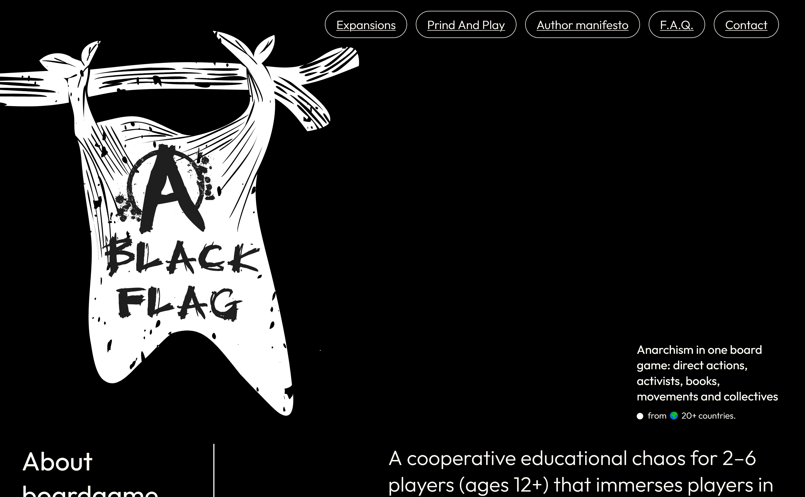
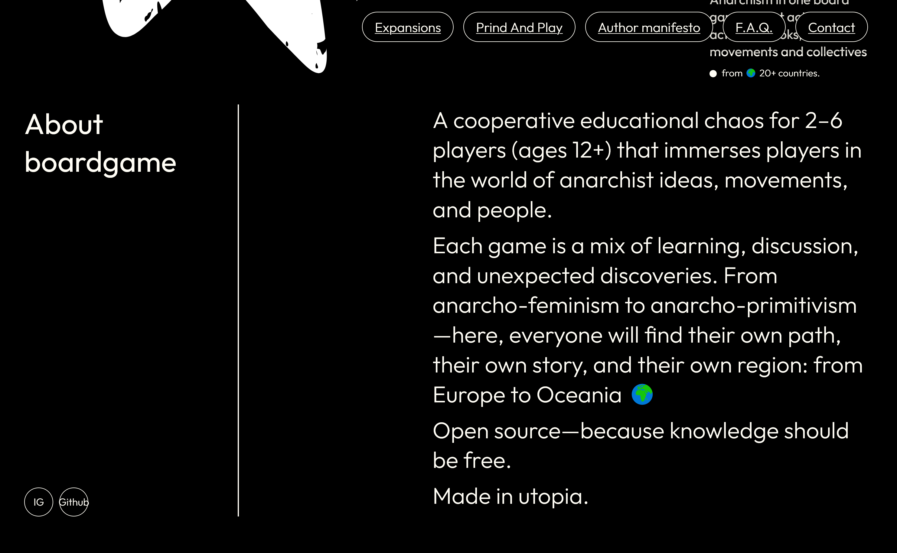
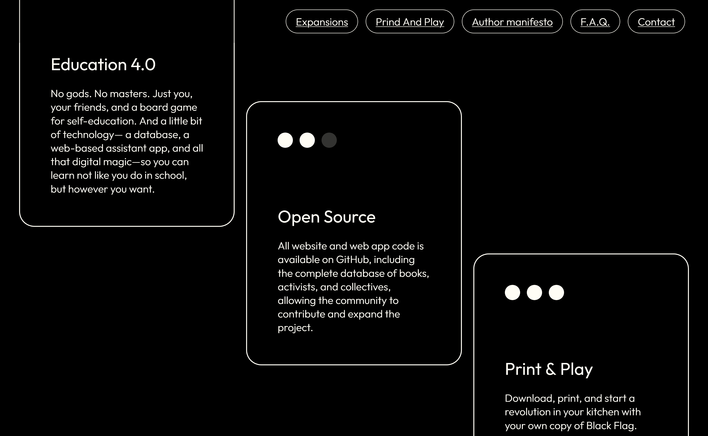
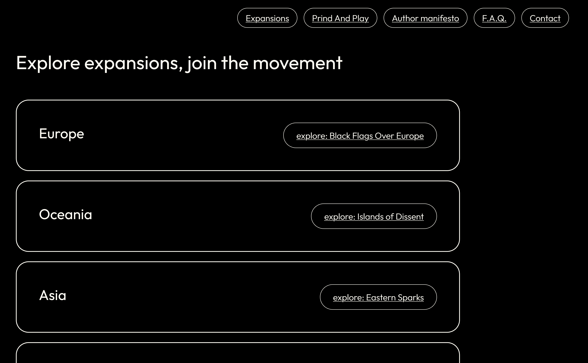
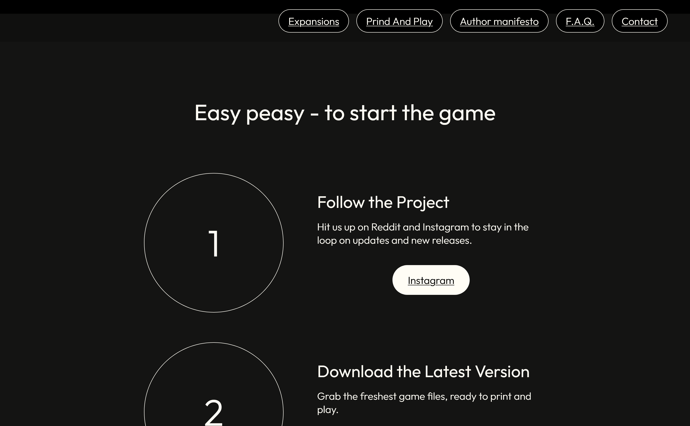
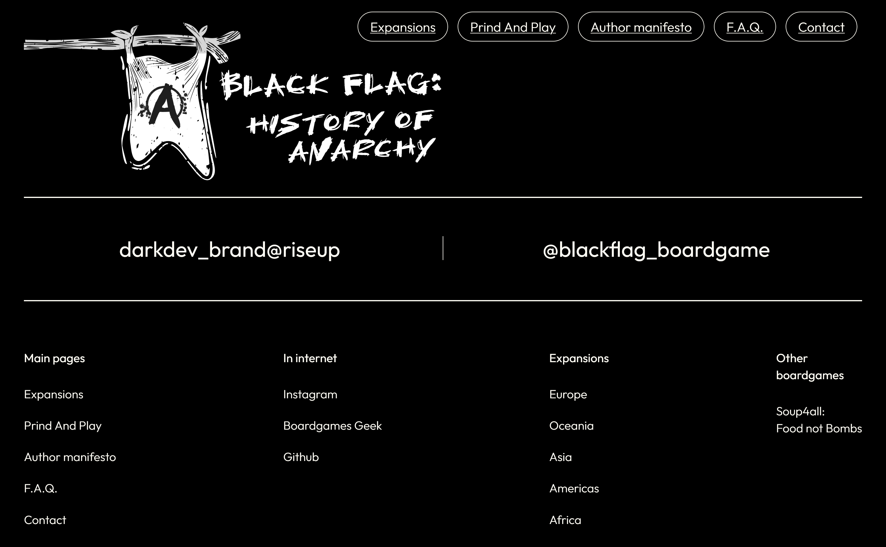

[![CC BY-NC-SA 4.0][cc-by-nc-sa-shield]][cc-by-nc-sa]

# 🏴 Black Flag: History of Anarchy

Anarchism in one board game: direct actions, activists, books, movements and collectives from 🌍 20+ countries.

The Black Flag includes:

- 🌍 A web platform for visualizing information about anarchism history
- 🗄 A database with a public API
- 🎲 A cooperative educational board game supplemented by a web application

_Check out the live project [\_here_](https://black-flag-game.vercel.app/).\_

## Table of Contents

- [Screenshots](#screenshots)
  - [Landing](#landing)
  - [APP](#app)
  - [Boardgame](#boardgame)
- [Acknowledgements](#acknowledgements)
- [Technologies](#technologies)
<!-- * [Usage](#usage)
  * [Prerequisites](#prerequisites)
  * [Installation](#installation)
  * [Environment Variables Setup](#environment-variables-setup)
  * [Run The App](#run-the-app) -->
- [License](#license)
- [Contact](#contact)

(<a href="#readme-top">back to top</a>)

### Landing

|           |            |
| :--------------------------------------------: | :-----------------------------------------------: |
|                     _Hero_                     |                      _About_                      |
|       |  |
|                    _Values_                    |                   _Expansions_                    |
|  |          |
|                _Print and Play_                |                     _Footer_                      |

(<a href="#readme-top">back to top</a>)

### APP

### Boardgame

## 👾 Technologies

- [Typescipt](https://www.typescriptlang.org/).
- [FSD architecture](https://feature-sliced.design/ru/docs/get-started)
- [SvelteJS](https://svelte.dev/)
- [TailwindCSS](https://tailwindcss.com/)
- [SvelteKIT](https://kit.svelte.dev/)

(<a href="#readme-top">back to top</a>)

## 🖌 Creators

<table>
 <tr>
    <td align="center">
     
    <b>Oleg_darkDev</b> Product Web engineer 
    <a href="https://github.com/oleg-darkdev">GitHub</a>
    <a href="https://www.linkedin.com/in/oleg-darkdev">LinkedIn</a>
    <a href="https://oleg-darkdev.vercel.app/">Site</a>
    </td>
    
 </tr>
</table>

(<a href="#readme-top">back to top</a>)

## 💪🏼 Show your support

Give a ⭐️ if you like our stuff!

## 🏴 Black Flag - in social media

  
  
 

## 🌿 Get in touch

## 📝 License

Shield: [![CC BY-NC-SA 4.0][cc-by-nc-sa-shield]][cc-by-nc-sa]

This project is licensed under a
[Creative Commons Attribution-NonCommercial-ShareAlike 4.0 International License][cc-by-nc-sa].

[![CC BY-NC-SA 4.0][cc-by-nc-sa-image]][cc-by-nc-sa]

[cc-by-nc-sa]: http://creativecommons.org/licenses/by-nc-sa/4.0/
[cc-by-nc-sa-image]: https://licensebuttons.net/l/by-nc-sa/4.0/88x31.png
[cc-by-nc-sa-shield]: https://img.shields.io/badge/License-CC%20BY--NC--SA%204.0-lightgrey.svg

<!-- This project is  licensed. -->

(<a href="#readme-top">back to top</a>)

